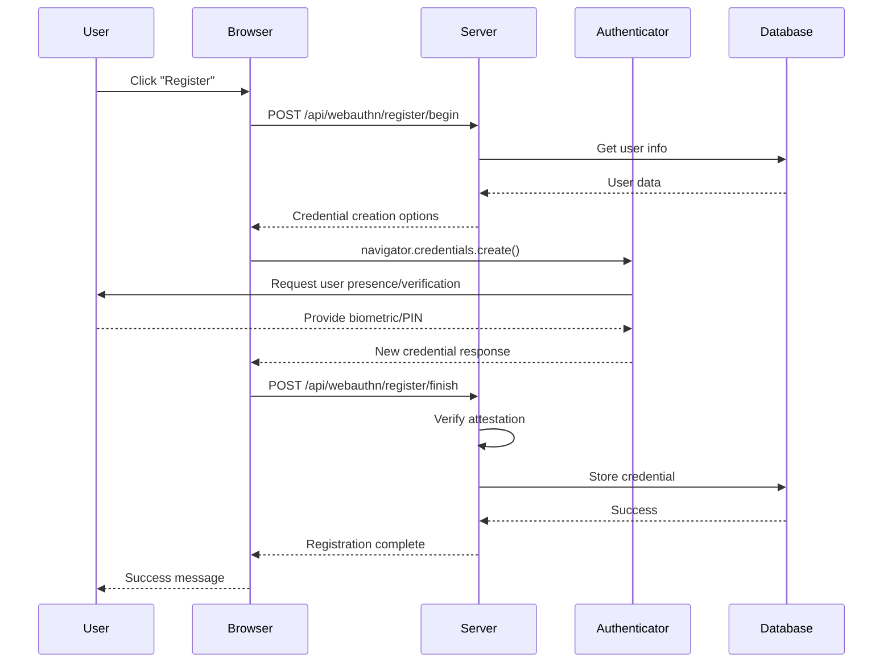
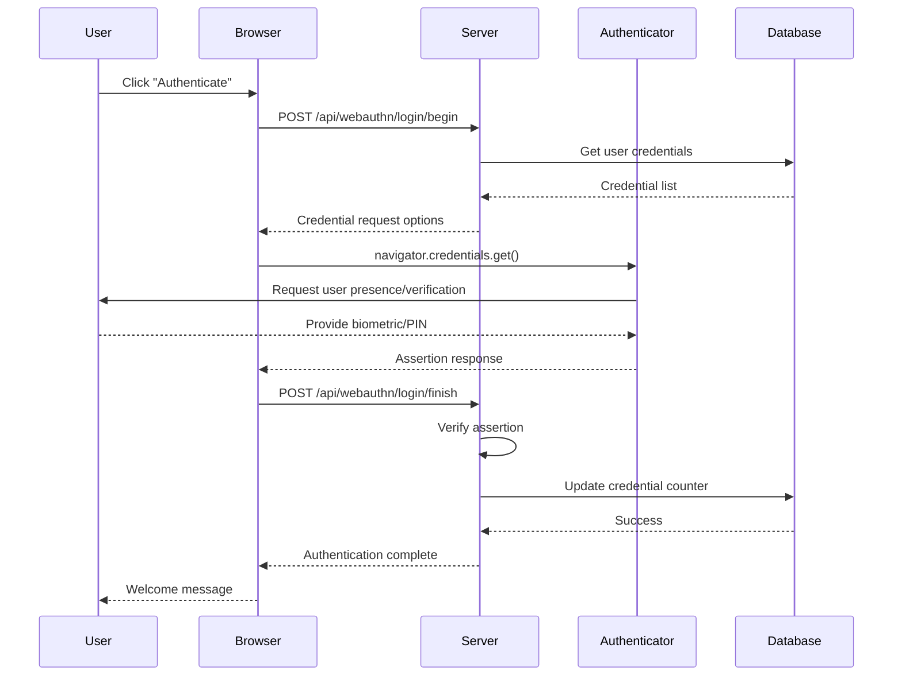

# WebAuthn Demo Application

A lightweight WebAuthn implementation in Go using the Gin framework, SQLite database, and Docker. This application demonstrates the complete WebAuthn flow for passwordless authentication using FIDO2/WebAuthn standards.

## 🚀 Features

- **Complete WebAuthn Flow**: Registration and authentication ceremonies
- **Lightweight**: Built with Gin framework for minimal overhead
- **SQLite Database**: Simple, embedded database for credential storage
- **Docker Support**: Easy deployment with Docker and Docker Compose
- **Modern UI**: Clean, responsive web interface for testing
- **Security**: Follows WebAuthn security best practices

## 📋 Prerequisites

- Go 1.21 or later
- Docker and Docker Compose (for containerized deployment)
- Modern web browser with WebAuthn support
- HTTPS environment (required for WebAuthn in production)

## 🏗️ Architecture

```
┌─────────────────┐    ┌─────────────────┐    ┌─────────────────┐
│   Web Browser   │    │   Go Server     │    │   SQLite DB     │
│   (WebAuthn     │    │   (Gin + go-    │    │   (Users &      │
│    Client)      │◄──►│    webauthn)    │◄──►│  Credentials)   │
└─────────────────┘    └─────────────────┘    └─────────────────┘
```

### Components

1. **Models Layer**: User and Credential entities with WebAuthn interface implementations
2. **Database Layer**: GORM-based repositories for data persistence
3. **Service Layer**: WebAuthn service handling authentication flows
4. **API Layer**: Gin HTTP handlers for REST endpoints
5. **UI Layer**: Modern HTML/CSS/JS interface for testing

## 🔧 Installation & Setup

### Option 1: Docker (Recommended)

1. Clone the repository:

```bash
git clone <repository-url>
cd webauthn-demo
```

2. Build and run with Docker Compose:

```bash
docker-compose up --build
```

3. Access the application at `http://localhost:8080`

### Option 2: Local Development

1. Install dependencies:

```bash
go mod tidy
```

2. Run the application:

```bash
go run main.go
```

3. Access the application at `http://localhost:8080`

## 📡 API Endpoints

### User Management

#### POST `/api/register`

Creates a new user account.

**Request:**
```json
{
  "username": "john_doe",
  "display_name": "John Doe"
}
```

**Response:**
```json
{
  "message": "User created successfully",
  "user": {
    "username": "john_doe",
    "display_name": "John Doe"
  }
}
```

#### GET `/api/user/{username}`

Retrieves user information.

**Response:**
```json
{
  "username": "john_doe",
  "display_name": "John Doe",
  "credentials": 1
}
```

### WebAuthn Registration Flow

#### POST `/api/webauthn/register/begin`

Initiates the WebAuthn registration ceremony.

**Request:**

```json
{
  "username": "john_doe"
}
```

**Response:**

```json
{
  "challenge": "base64-encoded-challenge",
  "rp": {
    "id": "localhost",
    "name": "WebAuthn Demo"
  },
  "user": {
    "id": "base64-encoded-user-id",
    "name": "john_doe",
    "displayName": "John Doe"
  },
  "pubKeyCredParams": [...],
  "authenticatorSelection": {...},
  "timeout": 300000,
  "attestation": "none"
}
```

#### POST `/api/webauthn/register/finish`
Completes the WebAuthn registration ceremony.

**Request:**
```json
{
  "id": "credential-id",
  "rawId": "base64-encoded-raw-id",
  "response": {
    "clientDataJSON": "base64-encoded-client-data",
    "attestationObject": "base64-encoded-attestation-object"
  },
  "type": "public-key",
  "username": "john_doe"
}
```

**Response:**
```json
{
  "message": "Registration completed successfully",
  "credential_id": "base64-encoded-credential-id"
}
```

### WebAuthn Authentication Flow

#### POST `/api/webauthn/login/begin`

Initiates the WebAuthn authentication ceremony.

**Request:**

```json
{
  "username": "john_doe"
}
```

**Response:**

```json
{
  "challenge": "base64-encoded-challenge",
  "timeout": 300000,
  "rpId": "localhost",
  "allowCredentials": [
    {
      "id": "base64-encoded-credential-id",
      "type": "public-key",
      "transports": ["usb", "nfc", "ble", "internal"]
    }
  ],
  "userVerification": "preferred"
}
```

#### POST `/api/webauthn/login/finish`

Completes the WebAuthn authentication ceremony.

**Request:**

```json
{
  "id": "credential-id",
  "rawId": "base64-encoded-raw-id",
  "response": {
    "clientDataJSON": "base64-encoded-client-data",
    "authenticatorData": "base64-encoded-authenticator-data",
    "signature": "base64-encoded-signature",
    "userHandle": "base64-encoded-user-handle"
  },
  "type": "public-key",
  "username": "john_doe"
}
```

**Response:**

```json
{
  "message": "Authentication completed successfully",
  "credential_id": "base64-encoded-credential-id"
}
```

## 🔄 WebAuthn Communication Flow

### Registration Flow



### Authentication Flow



## 🎯 Testing the Application

1. **Open the application** in a modern browser at `http://localhost:8080`

2. **Check WebAuthn support**: The page will display whether your browser supports WebAuthn

3. **Create a user account**:
   - Enter a username and display name
   - Click "Create User"

4. **Register a WebAuthn credential**:
   - Enter the username you just created
   - Click "Start Registration"
   - Follow your browser/device prompts for biometric or security key

5. **Authenticate**:
   - Enter your username
   - Click "Start Authentication"
   - Provide biometric or security key verification

6. **View user info**:
   - Enter username and click "Get User Info"
   - See registered credentials count

## 🔒 Security Considerations

### Implemented Security Features

- **Challenge-Response Authentication**: Prevents replay attacks
- **Origin Validation**: Ensures requests come from authorized domains
- **User Verification**: Supports biometric and PIN verification
- **Credential Isolation**: Each credential is scoped to specific Relying Party
- **Signature Counter**: Detects cloned authenticators

### Production Considerations

1. **HTTPS Required**: WebAuthn only works over HTTPS in production
2. **Domain Configuration**: Update RP ID and origins for your domain
3. **Session Management**: Replace in-memory session store with proper backend
4. **Database Security**: Use proper database credentials and encryption
5. **Rate Limiting**: Implement rate limiting for API endpoints
6. **Input Validation**: Additional validation for production use

## 🛠️ Development

### Project Structure

```
webauthn-demo/
├── main.go                 # Application entry point
├── go.mod                 # Go modules file
├── models/                # Data models
│   ├── user.go           # User model with WebAuthn interface
│   └── credential.go     # Credential model
├── database/             # Database layer
│   └── database.go       # GORM setup and repositories
├── services/             # Business logic
│   └── webauthn_service.go # WebAuthn service
├── templates/            # HTML templates
│   └── index.html        # Main UI
├── static/              # Static files (CSS, JS, images)
├── Dockerfile           # Docker configuration
├── docker-compose.yml   # Docker Compose setup
└── README.md           # This file
```

### Dependencies

- **github.com/gin-gonic/gin**: HTTP web framework
- **github.com/go-webauthn/webauthn**: WebAuthn library
- **gorm.io/gorm**: ORM library
- **gorm.io/driver/sqlite**: SQLite driver
- **github.com/google/uuid**: UUID generation

### Building for Production

```bash
# Build binary
CGO_ENABLED=1 GOOS=linux go build -a -installsuffix cgo -o webauthn-demo .

# Build Docker image
docker build -t webauthn-demo:latest .
```

## 🐛 Troubleshooting

### Common Issues

1. **WebAuthn not supported**: Use a modern browser with HTTPS
2. **CORS errors**: Ensure proper origin configuration
3. **Database errors**: Check SQLite file permissions
4. **Build failures**: Ensure CGO is enabled for SQLite

### Debug Mode

Run with debug logging:

```bash
GIN_MODE=debug go run main.go
```

## 📚 Additional Resources

- [WebAuthn Specification](https://www.w3.org/TR/webauthn/)
- [FIDO Alliance](https://fidoalliance.org/)
- [go-webauthn Library](https://github.com/go-webauthn/webauthn)
- [WebAuthn Guide](https://webauthn.guide/)

## 📄 License

This project is open source and available under the [MIT License](LICENSE).

## 🤝 Contributing

Contributions are welcome! Please feel free to submit a Pull Request.

## 📞 Support

For questions or issues, please open an issue in the GitHub repository. 